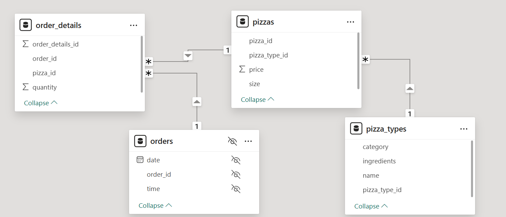

# 🍕 Pizzahut Sales Analysis (SQL-Based Project)

## 📌 About the Project
This **SQL-based project** analyzes **Pizzahut sales data**, focusing on order details, pizza types, and customer preferences. The database is structured to support insights into **sales trends, revenue generation, and popular pizza choices**.

## 📂 Database Schema & Tables
The database consists of four key tables:
1. **orders** – Contains details like order ID, date, and time.
2. **order_details** – Tracks individual pizza sales with quantity information.
3. **pizzas** – Stores pricing and size details for each pizza.
4. **pizza_types** – Defines pizza categories, ingredients, and names.

📌 **Schema Diagram**  
The **Schema Diagram (`Schema_diagram.png`)** visually represents the relationships between these tables.

## 📈 Key Insights
- **Total Sales Analysis** – Calculate revenue generated from different pizza types.
- **Best-Selling Pizzas** – Identify the most popular pizza categories and sizes.
- **Order Trends** – Analyze peak order times and sales by date.
- **Customer Preferences** – Understand ingredient preferences across different pizzas.

## 🚀 How to Use
1. **Download** the SQL scripts and dataset.
2. **Execute** `Database.sql` to create and populate the database.
3. **Run Queries** from:
   - `Basic Queries.sql` – Simple data retrieval queries.
   - `Intermediate Queries.sql` – Aggregation and filtering operations.
   - `Advanced Queries.sql` – Complex joins and analytical queries.
4. **Use SQL tools** like MySQL, PostgreSQL, or SQLite to explore the data.

## 🖥️ Tools Used
- **SQL (MySQL / PostgreSQL / SQLite)** for data storage and analysis.
- **DB Browser / MySQL Workbench** for query execution and visualization.

## 📎 Files in Repository
- `Pizzahut_Sales_dataset.zip` - The dataset files.
- `Database.sql` - SQL script to create and populate the database.
- `Basic Queries.sql` - Simple queries for data exploration.
- `Intermediate Queries.sql` - Aggregation and filtering queries.
- `Advanced Queries.sql` - Complex analytical queries.
- `Schema_diagram.png` - Database schema visualization.
- `README.md` - Project documentation.

---

📊 **Leverage SQL to gain valuable insights into Pizzahut's sales performance and customer preferences!**
